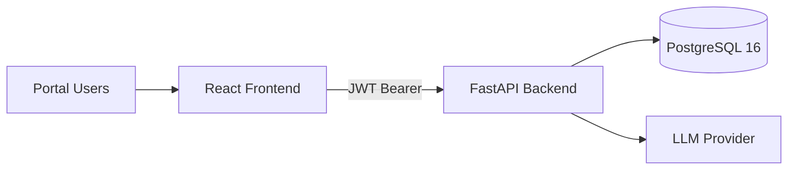

# AGM Portal MVP

AGM Portal MVP is a full-stack platform for AI project governance. It provides a centralized project registry, role-aware access control, portfolio analytics, CSV-based ingestion, and an assistant experience over user-visible project data.

## Highlights

- Password + email OTP multi-factor authentication before JWT issuance
- Trusted device flow to reduce repeated OTP prompts
- Global role controls (`researcher`, `management`, `admin`)
- Project-level access permissions with access-level templates and overrides
- Project updates, funding event tracking, and snapshot version restore
- Portfolio analytics for management and admin users
- AMGrant-style CSV ingestion endpoint
- Assistant endpoint with OpenAI, Ollama, and local OpenAI-compatible modes
- API and domain audit logging for traceability

## Architecture



## Technology Stack

| Layer | Technology |
| --- | --- |
| Frontend | React 18, TypeScript, Vite, Tailwind CSS, Recharts |
| Backend | FastAPI, SQLAlchemy 2, Pydantic v2, httpx |
| Authentication | Password + email OTP, JWT (HS256), trusted device cookie |
| Database | PostgreSQL 16 |
| Containerization | Docker Compose |
| Frontend serving | Nginx |

## Repository Layout

```text
backend/
  app/
    api/routes/      # auth, projects, analytics, ingest, assistant
    core/            # config, security, email
    db/              # db setup/session/init
    models/          # ORM models
    schemas/         # request/response schemas
  tests/             # backend tests
frontend/
  src/
    pages/
    components/
infra/
  amgrant_mock.csv
README.md
documentation.md
databaseNavigate.md
project-introduction.md
docker-compose.yml
```

## Quick Start (Docker)

### Prerequisites

- Docker Engine / Docker Desktop
- Docker Compose v2

### Start the stack

```bash
docker compose up -d --build
docker compose ps
curl http://localhost:8000/health
```

### Service URLs

- Frontend: [http://localhost:5173](http://localhost:5173)
- Backend API docs: [http://localhost:8000/docs](http://localhost:8000/docs)
- Health check: [http://localhost:8000/health](http://localhost:8000/health)
- PostgreSQL (host access): `localhost:5433`

### Demo accounts

These users are seeded on backend startup if missing:

| Email | Role | Password |
| --- | --- | --- |
| `dsa10ademo@gmail.com` | `admin` | `password` |
| `dsa10ademo+admin@gmail.com` | `admin` | `password` |
| `dsa10ademo+management@gmail.com` | `management` | `password` |
| `dsa10ademo+researcher@gmail.com` | `researcher` | `password` |

## Local Development (Without Docker)

### Backend

```bash
cd backend
python -m venv .venv
source .venv/bin/activate
pip install -r requirements.txt
uvicorn app.main:app --host 0.0.0.0 --port 8000
```

### Frontend

```bash
cd frontend
npm install
npm run dev
```

Frontend defaults to `http://localhost:8000/api/v1` unless `VITE_API_URL` is set.

## Configuration

Backend settings are defined in `backend/app/core/config.py` and can be overridden with environment variables.

| Variable | Purpose | Default / Compose Value |
| --- | --- | --- |
| `ENV` | Runtime mode | `dev` |
| `SECRET_KEY` | JWT signing key | `dev-secret-change-me` (compose) |
| `DATABASE_URL` | SQLAlchemy database URL | `postgresql+psycopg2://postgres:postgres@db:5432/agm` |
| `BACKEND_CORS_ORIGINS` | Allowed web origins | `http://localhost:5173,http://localhost:3000` |
| `LLM_MODE` | Assistant provider mode | compose default: `1`; code default: `3` |
| `OPENAI_API_KEY` | OpenAI key for mode `1` | empty |
| `OPENAI_MODEL` | OpenAI model | `gpt-4o-mini` |
| `OLLAMA_BASE_URL` | Ollama endpoint | `http://host.docker.internal:11434` |
| `OLLAMA_MODEL` | Ollama model | `phi3:mini` |
| `LOCAL_LLM_BASE_URL` | Local OpenAI-compatible endpoint | `http://host.docker.internal:1234/v1` |
| `LOCAL_LLM_MODEL` | Local model ID | `Phi-3-mini-128k-instruct` (compose) |
| `LOCAL_LLM_API_KEY` | Optional local endpoint token | empty |
| `RESEND_API_KEY` | OTP email provider key | empty |
| `RESEND_FROM_EMAIL` | OTP sender email | `onboarding@resend.dev` |

### Assistant provider modes

- `1`: OpenAI (`/v1/chat/completions`)
- `2`: Ollama (`/api/chat`)
- `3`: Local OpenAI-compatible endpoint (`/chat/completions`)

## Authentication and Access

### Login flow

1. User submits credentials to `POST /api/v1/auth/token`.
2. Backend validates password and issues an OTP challenge.
3. User verifies OTP via `POST /api/v1/auth/otp/verify`.
4. Backend returns JWT only after successful OTP verification.

Related endpoints:

- `POST /api/v1/auth/token`
- `POST /api/v1/auth/otp/resend`
- `POST /api/v1/auth/otp/verify`
- `POST /api/v1/auth/logout`

### Role model

- `researcher`: project registry and project-level actions where permitted
- `management`: researcher capabilities + portfolio analytics + CSV ingest
- `admin`: full platform privileges (including user administration and end-project actions)

### Project visibility and control

- All authenticated users can list projects.
- Users without project access see limited registry fields.
- Full detail and mutation rights require owner/admin or explicit project permission.

## API Surface

Base prefix: `/api/v1`

- Auth: `/auth/*`
- Projects and options: `/projects/*`
- Analytics: `/analytics/portfolio`
- Ingestion: `/integrations/amgrant/ingest`
- Assistant: `/assistant/chat`
- Public health endpoint: `/health`

## Testing

Run backend MFA tests:

```bash
cd backend
pytest tests/test_auth_mfa.py
```

## Operations

Start or rebuild:

```bash
docker compose up -d --build
```

Stop (retain DB volume):

```bash
docker compose down
```

Full reset (remove DB volume and images):

```bash
docker compose down --volumes --remove-orphans --rmi all
docker compose up -d --build
```

## Documentation

- Technical reference: [documentation.md](./documentation.md)
- Database operations: [databaseNavigate.md](./databaseNavigate.md)
- Non-technical product overview: [project-introduction.md](./project-introduction.md)

## Production Notes

Before production deployment:

- Replace `SECRET_KEY` and remove demo credentials
- Restrict CORS to approved frontend origins
- Add migration workflow (e.g., Alembic)
- Add secure secret management, backups, and monitoring
- Add rate limiting, hardening, and broader automated test coverage
