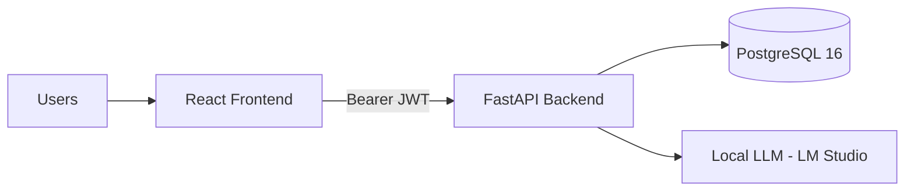

# AGM Portal MVP

AGM Portal MVP is a full-stack, role-aware AI project portfolio platform for project registry, access control, analytics, ingestion, and assistant workflows.

This repository contains:

- React frontend (`frontend/`)
- FastAPI backend (`backend/`)
- PostgreSQL database (Docker service)
- Docker Compose orchestration (`docker-compose.yml`)

## Core Capabilities

- Email OTP MFA with final JWT issuance after OTP verification
- Role-based route and API protection after MFA (`researcher`, `management`, `admin`)
- Centralized project registry with project-level permission controls
- Lifecycle metadata tracking (`lifecycle_stage`, `trl_level`, `trc_category`)
- Project updates, funding event ledger, and snapshot version restore
- Portfolio analytics for management and admin users
- AMGrant-style CSV ingestion endpoint
- LLM assistant with 3 provider modes (OpenAI, Ollama, LM studio)
- Authenticated request auditing plus domain action audit logs

## Runtime Architecture




## Technology Stack


| Layer            | Technology                                         |
| ---------------- | -------------------------------------------------- |
| Frontend         | React 18, TypeScript, Vite, Tailwind CSS, Recharts |
| Backend          | FastAPI, SQLAlchemy 2, Pydantic v2, httpx          |
| Auth             | Password + email OTP MFA, then JWT (HS256)        |
| Database         | PostgreSQL 16                                      |
| Containers       | Docker Compose                                     |
| Frontend Serving | Nginx                                              |


## Repository Layout

```text
backend/
  app/
    api/routes/         # auth, projects, analytics, ingest, assistant
    core/               # config and security
    db/                 # SQLAlchemy engine/session/init
    models/             # ORM models
    schemas/            # request/response models
frontend/
  src/
    pages/              # app pages
    components/         # layout, assistant chat, shared UI
infra/
  amgrant_mock.csv
README.md
documentation.md
databaseNavigate.md
docker-compose.yml
```

## Quick Start (Docker)

From repository root:

```bash
docker compose up -d --build
docker compose ps
curl http://localhost:8000/health
```

Primary URLs:

- Frontend: [http://localhost:5173](http://localhost:5173)
- Swagger UI: [http://localhost:8000/docs](http://localhost:8000/docs)
- Health: [http://localhost:8000/health](http://localhost:8000/health)

Default seeded users (created on startup if missing):

- `dsa10ademo+admin@gmail.com` / `password`
- `dsa10ademo+management@gmail.com` / `password`
- `dsa10ademo+researcher@gmail.com` / `password`

## Operations

Start/restart services:

```bash
docker compose up -d --build
```

Stop services (keep DB volume):

```bash
docker compose down
```

Full reset (delete DB volume):

```bash
docker compose down --volumes --remove-orphans --rmi all
docker compose up -d --build
```

## Configuration Overview

Backend env vars (set in `docker-compose.yml`, loaded by `backend/app/core/config.py`):


| Variable               | Purpose                                   | Default                                               |
| ---------------------- | ----------------------------------------- | ----------------------------------------------------- |
| `ENV`                  | Runtime mode (`dev` / `prod`)             | `dev`                                                 |
| `SECRET_KEY`           | JWT signing key                           | `dev-secret-change-me` (compose)                      |
| `DATABASE_URL`         | SQLAlchemy connection string              | `postgresql+psycopg2://postgres:postgres@db:5432/agm` |
| `BACKEND_CORS_ORIGINS` | Allowed origins when `ENV=prod`           | `http://localhost:5173,http://localhost:3000`         |
| `LLM_MODE`             | Assistant default provider mode (`1/2/3`) | `3` (code default)                                    |
| `OPENAI_API_KEY`       | OpenAI key for mode `1`                   | empty                                                 |
| `OPENAI_MODEL`         | OpenAI model                              | `gpt-4o-mini`                                         |
| `OLLAMA_BASE_URL`      | Ollama endpoint                           | `http://host.docker.internal:11434`                   |
| `OLLAMA_MODEL`         | Ollama model                              | `phi3:mini`                                           |
| `LOCAL_LLM_BASE_URL`   | Local OpenAI-compatible endpoint          | `http://host.docker.internal:1234/v1`                 |
| `LOCAL_LLM_MODEL`      | Local model ID                            | `Phi-3-mini-128k-instruct`                            |
| `LOCAL_LLM_API_KEY`    | Optional token for local endpoint         | empty                                                 |
| `RESEND_API_KEY`       | Resend API key for OTP delivery           | empty                                                 |
| `RESEND_FROM_EMAIL`    | Resend sender address                     | `onboarding@resend.dev`                               |

## Login Flow

1. Submit email + password to `POST /api/v1/auth/token`.
2. Backend validates the password, invalidates any prior active login OTPs, creates a new OTP challenge, and emails a 6-digit code through Resend.
3. Frontend shows the OTP step instead of storing a JWT.
4. Submit `challenge_id` + OTP to `POST /api/v1/auth/otp/verify`.
5. Backend marks the challenge as used and only then returns the final bearer token.

Related endpoints:

- `POST /api/v1/auth/token`
- `POST /api/v1/auth/otp/resend`
- `POST /api/v1/auth/otp/verify`


Frontend env var:

- `VITE_API_URL` (optional), default `http://localhost:8000/api/v1`

## LLM Assistant Modes

Backend modes:

- `1`: OpenAI
- `2`: Ollama
- `3`: LM Studio

Frontend currently sends a fixed mode from `frontend/src/components/AssistantChat.tsx` via `CHAT_MODE` (default in code: `3`).

## Access Model (Summary)

Global roles:

- `researcher`
- `management`
- `admin`

Role-gated pages:

- `/dashboard`: management, admin
- `/import`: management, admin
- `/users`: admin

Project-level behavior:

- All authenticated users can list projects.
- Users without project access still see `title` and `people_involved` in registry list.
- Full project details and project actions require owner/admin or explicit project permission.
- Ending a project (`POST /projects/{id}/end`) is admin-only.

## API Surfaces

Base prefix: `/api/v1`

- Auth: `/auth/*`
- Projects and options: `/projects/*`
- Analytics: `/analytics/portfolio`
- Ingestion: `/integrations/amgrant/ingest`
- Assistant: `/assistant/chat`
- Public health: `/health`

## Documentation

- Technical reference: [documentation.md](./documentation.md)
- Database operations: [databaseNavigate.md](./databaseNavigate.md)

## Local MFA Testing

1. Export `RESEND_API_KEY` and optionally `RESEND_FROM_EMAIL`.
2. Start the stack with `docker compose up -d --build`.
3. Sign in with one of the demo users and password `password`.
4. Check the inbox for the OTP, then complete verification in the frontend.
5. Test resend cooldown, expired OTPs, wrong OTPs, and already-used/superseded OTP messages from the login screen.

## Production Hardening Checklist

Before production deployment:

- Replace `SECRET_KEY` and remove default/demo credentials
- Set `ENV=prod` and restrict `BACKEND_CORS_ORIGINS`
- Replace runtime schema patching with Alembic migrations
- Add HTTPS termination, secure secret management, backups, and monitoring
- Add rate limiting, stronger validation, and automated test coverage

