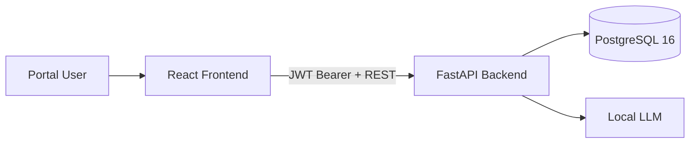
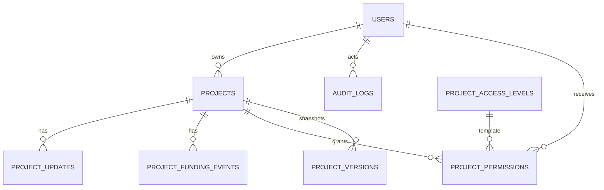

# AGM Portal MVP - Technical Documentation

## 1. Document Control


| Field        | Value                      |
| ------------ | -------------------------- |
| System       | AGM Portal MVP             |
| Version      | 2                          |
| Last Updated | 2026-03-18                 |
| Repository   | `dsa3101-2520-Project-10A` |


### 1.1 Purpose

This document is the implementation-aligned technical reference for AGM Portal MVP. It covers architecture, security and access controls, data model, API behavior, and operations.

### 1.2 Intended Audience

- Engineers maintaining backend/frontend code
- Operators running the Docker environment
- Security and governance stakeholders reviewing access and auditing behavior

## 2. System Overview

AGM Portal MVP is a role-aware AI project governance platform focused on:

- Project registry and controlled collaboration
- Lifecycle tracking (`lifecycle_stage`, `trl_level`, `trc_category`)
- Funding ledger and project updates
- Management/admin analytics
- CSV ingestion for AMGrant-style exports
- Assistant Q&A over user-visible portfolio data

### 2.1 Business Capabilities

1. Centralized registry for AI initiatives
2. Role-based and project-level permission enforcement
3. Project updates and funding event tracking
4. Project version snapshots with restore
5. Admin user provisioning and revocation safeguards
6. Request/action audit trails
7. Portfolio analytics for governance
8. Pluggable assistant providers (OpenAI, Ollama, LM Studio)

## 3. Architecture



### 3.1 Component Responsibilities


| Component               | Responsibilities                                                                                                    |
| ----------------------- | ------------------------------------------------------------------------------------------------------------------- |
| Frontend (`frontend/`)  | Login UX, route guards, registry and project workflows, analytics charts, CSV upload, assistant chat                |
| Backend (`backend/app`) | Auth, authorization, project APIs, options APIs, analytics, ingest, assistant orchestration, audit logging          |
| Database                | Persistent storage for users, projects, permissions, versions, updates, funding events, audits, option dictionaries |
| Docker Compose          | Service orchestration and startup dependencies                                                                      |


### 3.2 Request and Authorization Flow

1. User submits email and password to `POST /api/v1/auth/token`.
2. Backend validates credentials, creates a login OTP challenge, and sends a 6-digit OTP via Resend.
3. Frontend keeps the user on the login flow and stores the returned `challenge_id`.
4. User submits `challenge_id` plus OTP to `POST /api/v1/auth/otp/verify`.
5. Backend issues JWT (`sub`, `role`, `exp`) only after successful OTP verification.
6. Frontend stores token in `localStorage` under `agm_token` and includes `Authorization: Bearer <token>` in API calls.
7. Authenticated requests are logged by audit middleware.

## 4. Deployment Topology

### 4.1 Docker Compose Services


| Service    | Image/Build          | Ports       | Notes                   |
| ---------- | -------------------- | ----------- | ----------------------- |
| `db`       | `postgres:16-alpine` | `5433:5432` | Volume: `agm_db_data`   |
| `backend`  | `./backend`          | `8000:8000` | Depends on healthy `db` |
| `frontend` | `./frontend`         | `5173:80`   | Nginx serves Vite build |


### 4.2 Startup Behavior

On backend startup (`app.main:on_startup`):

1. `init_db()` creates tables and runs lightweight runtime schema alignment.
2. Access level rows are seeded/backfilled.
3. Demo users are seeded if missing:
  - `dsa10ademo+admin@gmail.com`
  - `dsa10ademo+management@gmail.com`
  - `dsa10ademo+researcher@gmail.com`

### 4.3 Health Endpoint

- `GET /health` returns `{"status":"ok"}` (no auth required).

## 5. Configuration Management

### 5.1 Backend Configuration

Defined in `backend/app/core/config.py` and overridden by environment variables:


| Variable                      | Default (Code)                                        | Typical Compose Value                          | Description                     |
| ----------------------------- | ----------------------------------------------------- | ---------------------------------------------- | ------------------------------- |
| `APP_NAME`                    | `AGM Portal MVP`                                      | same                                           | FastAPI title                   |
| `ENV`                         | `dev`                                                 | `dev`                                          | Runtime mode (`dev` / `prod`)   |
| `API_V1_PREFIX`               | `/api/v1`                                             | same                                           | API prefix                      |
| `SECRET_KEY`                  | `change-me`                                           | `dev-secret-change-me`                         | JWT signing key                 |
| `ACCESS_TOKEN_EXPIRE_MINUTES` | `1440`                                                | same                                           | Access token TTL                |
| `ALGORITHM`                   | `HS256`                                               | same                                           | JWT algorithm                   |
| `BACKEND_CORS_ORIGINS`        | `http://localhost:5173,http://localhost:3000`         | same                                           | Allowed origins in prod mode    |
| `DATABASE_URL`                | `postgresql+psycopg2://postgres:postgres@db:5432/agm` | same                                           | SQLAlchemy DB URL               |
| `LLM_MODE`                    | `3`                                                   | `${LLM_MODE:-1}`                               | Default assistant provider mode |
| `LLM_TIMEOUT_SECONDS`         | `30.0`                                                | same                                           | LLM timeout                     |
| `OPENAI_API_KEY`              | `None`                                                | env                                            | OpenAI key                      |
| `OPENAI_MODEL`                | `gpt-4o-mini`                                         | `${OPENAI_MODEL:-gpt-4o-mini}`                 | OpenAI model                    |
| `OLLAMA_BASE_URL`             | `http://host.docker.internal:11434`                   | same                                           | Ollama base URL                 |
| `OLLAMA_MODEL`                | `phi3:mini`                                           | same                                           | Ollama model                    |
| `LOCAL_LLM_BASE_URL`          | `http://host.docker.internal:1234/v1`                 | same                                           | Local compatible endpoint       |
| `LOCAL_LLM_MODEL`             | `phi-3-mini-128k-instruct-imatrix-smashed`            | `${LOCAL_LLM_MODEL:-Phi-3-mini-128k-instruct}` | Local model ID                  |
| `LOCAL_LLM_API_KEY`           | `None`                                                | env                                            | Optional bearer token           |
| `RESEND_API_KEY`              | `None`                                                | env                                            | Resend API key for OTP emails   |
| `RESEND_API_URL`              | `https://api.resend.com/emails`                       | same                                           | Resend email endpoint           |
| `RESEND_FROM_EMAIL`           | `onboarding@resend.dev`                               | env or same                                    | OTP sender address              |
| `MFA_OTP_EXPIRE_MINUTES`      | `10`                                                  | same                                           | OTP validity window             |
| `MFA_RESEND_COOLDOWN_SECONDS` | `60`                                                  | same                                           | OTP resend cooldown             |
| `MFA_MAX_ATTEMPTS`            | `5`                                                   | same                                           | Max wrong OTP attempts          |


### 5.2 Frontend Configuration


| Variable       | Default                        | Description          |
| -------------- | ------------------------------ | -------------------- |
| `VITE_API_URL` | `http://localhost:8000/api/v1` | Backend API base URL |


### 5.3 CORS Behavior

- `ENV=prod`: only origins in `BACKEND_CORS_ORIGINS` are allowed.
- Non-prod modes: wildcard `*` is allowed for development convenience.

## 6. Security Model

### 6.1 Authentication

- Password-first login challenge via `application/x-www-form-urlencoded`
- 6-digit email OTP delivered through Resend
- JWT bearer token for API access after OTP verification
- Password and OTP hashing via bcrypt (`passlib`)

### 6.2 Global Roles


| Capability                         | Researcher | Management | Admin |
| ---------------------------------- | ---------- | ---------- | ----- |
| Login and use registry             | Yes        | Yes        | Yes   |
| Dashboard (`/analytics/portfolio`) | No         | Yes        | Yes   |
| AMGrant ingest                     | No         | Yes        | Yes   |
| User provisioning/revocation       | No         | No         | Yes   |
| Delete project                     | No         | No         | Yes   |
| End project (`/projects/{id}/end`) | No         | No         | Yes   |


### 6.3 Project Access Control

Owners and admins have full project access by default.

For non-owner/non-admin users, `project_permissions` determines access:

- `view`: true if any of `can_view`, `can_edit`, `can_add_update`, `can_add_funding`, `can_manage_access`
- `edit`: requires `can_edit`
- `add_update`: requires `can_add_update` or `can_edit`
- `add_funding`: requires `can_add_funding` or `can_edit`
- `manage_access`: requires `can_manage_access`

### 6.4 Access Level Templates and Overrides

Permission rows store both:

- `access_level_key` (`principal_investigator`, `team_member`, `viewer`)
- Effective boolean flags (`can_*`) and optional overrides (`override_can_*`)

Runtime backfill aligns legacy rows with access-level templates.

### 6.5 Auditing

Two layers are implemented:

1. Middleware API audit for authenticated requests (`action=API_CALL`)
2. Domain action audits (login events, user/project mutations, ingestion, permission changes)

### 6.6 Account Deletion Safeguards

Admin user deletion blocks:

- Self-deletion
- Deleting the last remaining admin
- Deleting a user who still owns projects

References in related tables are reassigned to the acting admin when applicable.

## 7. Data Model

### 7.1 Entity Relationship Overview




### 7.2 Core Tables


| Table                                                                                                                              | Purpose                                        |
| ---------------------------------------------------------------------------------------------------------------------------------- | ---------------------------------------------- |
| `users`                                                                                                                            | User identity, role, password hash             |
| `projects`                                                                                                                         | Main project registry records                  |
| `project_permissions`                                                                                                              | User-by-project effective access and overrides |
| `project_access_levels`                                                                                                            | Access-level templates                         |
| `project_updates`                                                                                                                  | Timeline/status updates                        |
| `project_funding_events`                                                                                                           | Funding ledger entries                         |
| `project_versions`                                                                                                                 | Restorable project snapshots                   |
| `audit_logs`                                                                                                                       | API and domain audit trail                     |
| `login_otp_challenges`                                                                                                             | MFA OTP challenge lifecycle and state          |
| `institution_options`, `domain_options`, `ai_type_options`, `lifecycle_stage_options`, `trl_level_options`, `trc_category_options` | Standardized option dictionaries               |


### 7.3 Snapshot Scope

Project version snapshots include selected project fields such as:

- identity and taxonomy fields (`title`, `institution`, `domain`, `ai_type`)
- governance/maturity fields (`lifecycle_stage`, `trl_level`, `trc_category`)
- funding/timeline/collaboration fields
- descriptive fields

### 7.4 Runtime Schema Management

`init_db()` performs MVP-level schema alignment:

- create tables if missing
- add missing project columns used by current model
- convert `projects.end_date` to timestamp with time zone when needed
- align permission schema with access-level columns
- drop legacy columns/tables (`risk_level`, `compliance_status`, `approvals`, `project_audio_logs`, etc.)

This is not a substitute for formal migration tooling.

## 8. API Reference

Base URL: `http://localhost:8000`  
API prefix: `/api/v1`  
Auth: Bearer JWT unless marked otherwise

### 8.1 Public System Endpoint


| Method | Path      | Auth | Description          |
| ------ | --------- | ---- | -------------------- |
| GET    | `/health` | No   | Service health probe |


### 8.2 Auth Endpoints


| Method | Path                           | Auth  | Description                   |
| ------ | ------------------------------ | ----- | ----------------------------- |
| POST   | `/api/v1/auth/token`           | No    | Validate password and create OTP challenge |
| POST   | `/api/v1/auth/otp/resend`      | No    | Resend OTP for an existing challenge |
| POST   | `/api/v1/auth/otp/verify`      | No    | Verify OTP and issue final JWT |
| GET    | `/api/v1/auth/me`              | Yes   | Current user profile          |
| POST   | `/api/v1/auth/register`        | Admin | Create user                   |
| GET    | `/api/v1/auth/users`           | Admin | List users                    |
| DELETE | `/api/v1/auth/users/{user_id}` | Admin | Delete user (with safeguards) |


### 8.3 Project Registry Endpoints


| Method | Path                                | Auth                | Description                             |
| ------ | ----------------------------------- | ------------------- | --------------------------------------- |
| GET    | `/api/v1/projects`                  | Yes                 | List projects with visibility filtering |
| POST   | `/api/v1/projects`                  | Yes                 | Create project                          |
| GET    | `/api/v1/projects/{project_id}`     | Project view access | Get project details                     |
| PATCH  | `/api/v1/projects/{project_id}`     | Project edit access | Update project fields                   |
| POST   | `/api/v1/projects/{project_id}/end` | Admin               | Mark project completed                  |
| DELETE | `/api/v1/projects/{project_id}`     | Admin               | Delete project                          |


Supported query parameters for `GET /projects`:

- `q`
- `institution`
- `lifecycle_stage`
- `trl_level`
- `trc_category`

### 8.4 Options Endpoints


| Method | Path                                        | Auth | Description                    |
| ------ | ------------------------------------------- | ---- | ------------------------------ |
| GET    | `/api/v1/projects/options`                  | Yes  | Get merged option dictionaries |
| POST   | `/api/v1/projects/options/institutions`     | Yes  | Upsert institution option      |
| POST   | `/api/v1/projects/options/domains`          | Yes  | Upsert domain option           |
| POST   | `/api/v1/projects/options/ai-types`         | Yes  | Upsert AI type option          |
| POST   | `/api/v1/projects/options/lifecycle-stages` | Yes  | Upsert lifecycle-stage option  |
| POST   | `/api/v1/projects/options/trl-levels`       | Yes  | Upsert TRL option              |
| POST   | `/api/v1/projects/options/trc-categories`   | Yes  | Upsert TRC option              |


### 8.5 Project Activity Endpoints


| Method | Path                                    | Auth               | Description                                   |
| ------ | --------------------------------------- | ------------------ | --------------------------------------------- |
| POST   | `/api/v1/projects/{project_id}/updates` | Add-update access  | Add timeline entry                            |
| GET    | `/api/v1/projects/{project_id}/updates` | View access        | List timeline entries                         |
| POST   | `/api/v1/projects/{project_id}/funding` | Add-funding access | Add funding event and roll up project funding |
| GET    | `/api/v1/projects/{project_id}/funding` | View access        | List funding events                           |


### 8.6 Permission and Versioning Endpoints


| Method | Path                                                          | Auth                      | Description                   |
| ------ | ------------------------------------------------------------- | ------------------------- | ----------------------------- |
| GET    | `/api/v1/projects/{project_id}/permissions`                   | Owner/Admin/Manage-access | List permission rows          |
| POST   | `/api/v1/projects/{project_id}/permissions`                   | Owner/Admin/Manage-access | Create/update permission row  |
| DELETE | `/api/v1/projects/{project_id}/permissions/{target_user_id}`  | Owner/Admin/Manage-access | Revoke permission row         |
| GET    | `/api/v1/projects/{project_id}/access-candidates`             | Owner/Admin/Manage-access | List assignable users         |
| GET    | `/api/v1/projects/{project_id}/versions`                      | View access               | List version metadata         |
| POST   | `/api/v1/projects/{project_id}/versions/{version_id}/restore` | Edit access               | Restore project from snapshot |


### 8.7 Analytics Endpoint


| Method | Path                          | Auth             | Description                           |
| ------ | ----------------------------- | ---------------- | ------------------------------------- |
| GET    | `/api/v1/analytics/portfolio` | Management/Admin | Portfolio snapshot and risk analytics |


Response includes:

- project totals and active count
- total spend
- counts by institution/domain/lifecycle/deployment/governance/risk
- overdue or inactive project list
- funding splits (domain, institution, matrix)
- project cycle rows

### 8.8 Integration Endpoint


| Method | Path                                  | Auth             | Description              |
| ------ | ------------------------------------- | ---------------- | ------------------------ |
| POST   | `/api/v1/integrations/amgrant/ingest` | Management/Admin | Ingest AMGrant-style CSV |


Ingestion behavior:

- requires `.csv` filename
- match key is exact `title + institution`
- creates if missing, updates if existing
- returns `{created, updated}`

### 8.9 Assistant Endpoint


| Method | Path                     | Auth | Description                                    |
| ------ | ------------------------ | ---- | ---------------------------------------------- |
| POST   | `/api/v1/assistant/chat` | Yes  | Assistant response using selected/default mode |


Request fields:

- `message` (required)
- `history` (optional, max 20)
- `mode` (optional: `1` OpenAI, `2` Ollama, `3` local)

If provider call fails, backend returns a fallback response derived from visible portfolio context.

## 9. Frontend Module Reference

### 9.1 Routes


| Route                | Component        | Access                                                     |
| -------------------- | ---------------- | ---------------------------------------------------------- |
| `/login`             | `Login`          | Public                                                     |
| `/projects`          | `Projects`       | Authenticated                                              |
| `/projects/new`      | `ProjectForm`    | Authenticated                                              |
| `/projects/:id`      | `ProjectDetail`  | Authenticated (detail data subject to project access)      |
| `/projects/:id/edit` | `ProjectForm`    | Authenticated (edit still enforced by backend permissions) |
| `/dashboard`         | `Dashboard`      | Management/Admin                                           |
| `/import`            | `Import`         | Management/Admin                                           |
| `/users`             | `UserManagement` | Admin                                                      |


### 9.2 Authentication Handling

- `challenge_id` and OTP step state are held client-side during login
- JWT stored in `localStorage` key `agm_token` only after successful OTP verification
- Axios request interceptor injects bearer token
- Guards:
  - `RequireAuth` for all app routes except login
  - `RequireRoles` for dashboard/import/users

### 9.3 Assistant UI Behavior

`frontend/src/components/AssistantChat.tsx` uses a hardcoded `CHAT_MODE` constant (default `3`). Users do not currently switch provider mode in UI.

## 10. Operations Runbook

### 10.1 Start and Verify

```bash
docker compose up -d --build
docker compose ps
curl http://localhost:8000/health
```

### 10.2 Stop / Restart

```bash
docker compose down
docker compose restart backend frontend
```

### 10.3 Rebuild App Layers

```bash
docker compose up -d --build backend frontend
```

### 10.4 Full Reset (Data Destructive)

```bash
docker compose down --volumes --remove-orphans
docker compose up -d --build
```

Optional image reset:

```bash
docker compose down --volumes --remove-orphans --rmi all
docker compose up -d --build
```

### 10.5 Logs and API Docs

```bash
docker compose logs --tail=100 backend
```

Swagger UI: [http://localhost:8000/docs](http://localhost:8000/docs)

### 10.6 Database Access

Host connection:

- Host: `localhost`
- Port: `5433`
- User: `postgres`
- Password: `postgres`
- Database: `agm`

In-container `psql`:

```bash
docker compose exec db psql -U postgres -d agm
```

## 11. Troubleshooting

### 11.1 Backend Unreachable

Checks:

1. `docker compose ps`
2. `docker compose logs backend --tail=200`
3. Confirm backend is bound on `8000` and DB is healthy

### 11.2 Database Connection Errors

Checks:

1. `DATABASE_URL` uses `db:5432` inside Compose network
2. `db` service health is `healthy`
3. Credentials match runtime environment

### 11.3 Login Failures

Checks:

1. Verify seeded/demo users exist in `users`
2. Ensure `SECRET_KEY` remains consistent for active token validation
3. Inspect `audit_logs` for `LOGIN`, `LOGIN_FAILED`, `LOGIN_OTP_SENT`, or `LOGIN_OTP_FAILED`
4. Verify `RESEND_API_KEY` is set if OTP delivery is failing

### 11.4 CORS Errors

Checks:

1. For production: `ENV=prod` and `BACKEND_CORS_ORIGINS` must match frontend origin
2. For development: ensure frontend calls the intended API URL

### 11.5 Assistant Fallback Responses

Checks:

1. Confirm mode (`CHAT_MODE` in frontend or `mode` in request)
2. Verify provider endpoint and credentials
3. Inspect backend logs for upstream call errors/timeouts

### 11.6 CSV Ingest Failures

Checks:

1. File extension is `.csv`
2. Headers match expected names
3. Values are UTF-8 compatible and dates use `YYYY-MM-DD` when provided

## 12. Known Constraints and Technical Debt

1. No Alembic migration workflow yet; schema patching happens at runtime.
2. JWT model is access-token only (no refresh/revocation list).
3. Development defaults include demo credentials and insecure defaults.
4. Assistant provider mode is hardcoded in frontend (`CHAT_MODE`).
5. Audit table retention/archival policy is not implemented.
6. Frontend E2E coverage is still not included in this repository.

## 13. Recommended Production Hardening

1. Introduce Alembic migrations and controlled promotion.
2. Remove demo account seeding and integrate enterprise identity provider.
3. Enforce TLS, secure secret storage, and credential rotation.
4. Add rate limits, abuse controls, and stronger request validation.
5. Implement observability (metrics, traces, structured logs).
6. Define and test backup and disaster-recovery procedures.
7. Add automated unit/integration/API/E2E testing.

## 14. Appendix - Example Requests

### 14.1 Login

```bash
curl -X POST http://localhost:8000/api/v1/auth/token \
  -H 'Content-Type: application/x-www-form-urlencoded' \
  -d 'username=dsa10ademo+admin@gmail.com&password=password'
```

### 14.2 Create Project

```bash
curl -X POST http://localhost:8000/api/v1/projects \
  -H 'Authorization: Bearer <TOKEN>' \
  -H 'Content-Type: application/json' \
  -d '{
    "title": "AI Oncology Prioritization",
    "institution": "Singapore General Hospital (SGH)",
    "domain": "Oncology",
    "ai_type": "Predictive Analytics",
    "lifecycle_stage": "Design & validation",
    "trl_level": "TRL 4 - lab validation",
    "trc_category": "Validation",
    "funding_amount_sgd": 250000
  }'
```

### 14.3 Grant Project Permission

```bash
curl -X POST http://localhost:8000/api/v1/projects/1/permissions \
  -H 'Authorization: Bearer <TOKEN>' \
  -H 'Content-Type: application/json' \
  -d '{
    "user_id": 7,
    "access_level": "team_member",
    "can_view": true,
    "can_edit": false,
    "can_add_update": true,
    "can_add_funding": false,
    "can_manage_access": false
  }'
```

### 14.4 Assistant Chat

```bash
curl -X POST http://localhost:8000/api/v1/assistant/chat \
  -H 'Authorization: Bearer <TOKEN>' \
  -H 'Content-Type: application/json' \
  -d '{
    "message": "Summarize active projects by domain.",
    "history": [],
    "mode": 1
  }'
```

